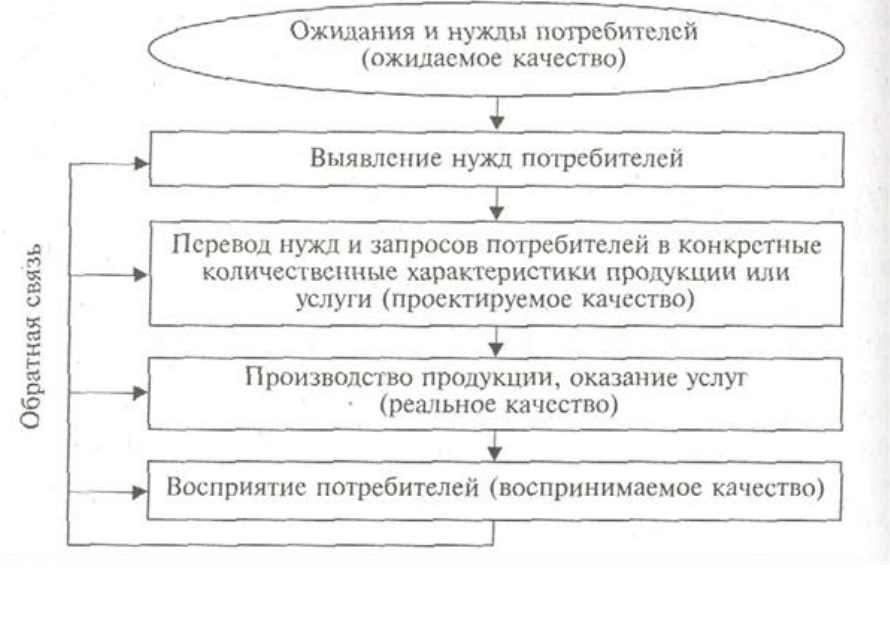
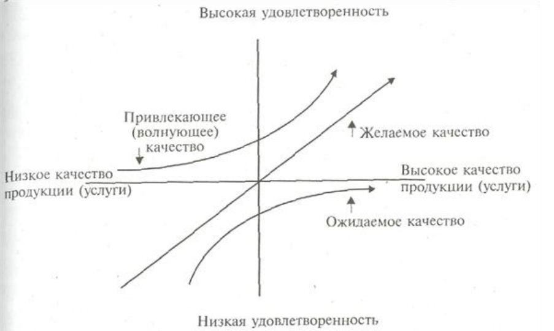

# Ориентация на потребителей в деятельности организации. Основные элементы и цикл управления взаимоотношениями с потребителями. Исследование удовлетворенности потребителей.
## Определение требований, относящихся к продукции. Определяются требования:
* устанавливаемые потребителями, включая требования к поставке и деятельности после поставки;
* не определенные потребителем, но необходимые для конкретного или предполагаемого использования;
* законодательные и другие обязательные, относящиеся к продукции;
* дополнительные, определенные организацией.
## Анализ требований, относящихся к продукции. Анализ проводится до принятия обязательств поставлять продукцию потребителю и обеспечивает:
* определение требований к продукции;
* согласование требований контракта или заказа, отличающихся от ранее сформулированных;
* способность организации выполнять определенные требования.
## Связь с потребителями. Определяются и осуществляются эффективные меры, но поддержанию связи с потребителями, касающиеся:
* информации о продукции;
* прохождения запросов, контракта или заказа;
* обратной связи с потребителями, включая их жалобы.
При исследовании удовлетворенности потребителей необходимо помнить ряд
правил:
• удовлетворенные потребители рассказывают о своем положительном впечатлении как минимум пяти знакомым, а в среднем — восьми, неудовлетворенные сообщают о своих впечатлениях разным людям в среднем 16 раз;
• для привлечения нового потребителя требуется в 5 раз больше затрат, чем для удержания существующего;
• 98 % неудовлетворенных потребителей не высказывают своих претензий к
организации.

