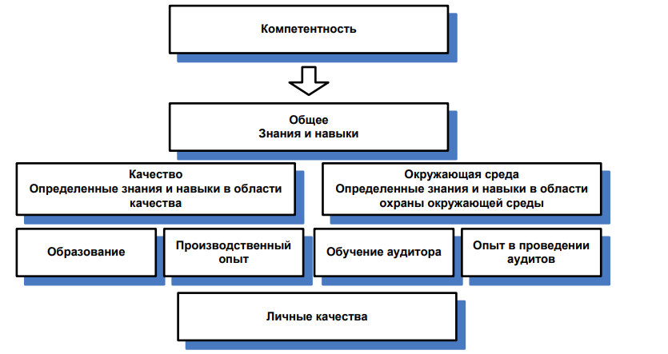

<ins>Аудит</ins>  –  систематический,  независимый,  документированный  процесс 
получения  свидетельств  аудита  и  объективного  их  оценивания  с  целью 
установления степени выполнения согласованных критериев аудита.  

## Проведение аудита: 
1.  Организация проведения аудита 
2.  Выполнение анализа документов 
3.  Подготовка к аудиту на месте 
4.  Проведение аудита на месте 
5.  Подготовка, утверждение и рассылка отчета (акта) по аудиту 
6.  Завершение аудита 
7.  Выполнение действий по результатам аудита

## Компетентность и оценка аудиторов 
<ins>Компетентность</ins> – это способность применять знания и навыки для достижения 
конечных результатов  

  
Оценку необходимо планировать  

## Личные качества: 
1.  Этичность – честность, благоразумие 
2.  Открытость и непредубежденность – желание принимать альтернативные идеи и точки зрения 
3.  Дипломатичность – тактичность  
4.  Наблюдательность – активное наблюдение за окружающей 
5.  Восприимчивость – осведомленность понимание .. 
6.  Универсальность  –  возможность  быстро  адаптироваться  в  различных ситуациях 
7.  Упорство 
8.  Решительность – своевременное принятие решения на основе лог  
9.  Самостоятельность – Выполнять функции независимо, результативно 
10. Принципиальность  
11. Готовность к самосовершенствованию 
12. Высокая культура поведения 
13. Умение сотрудничать и работать с людьми

## Знания и навыки: 
### Общие знания и навыки аудитов:  
1.  Принципы, процедуры и методы аудита 
2.  системы менеджмента и ссылочные документы; 
3.  специфика организационной деятельности;  
4.  общие знания и навыки руководителей аудиторских групп; 
5.  специальные знания и навыки аудиторов системы менеджмента качества; 
6.  специальные  знания  и  навыки  аудиторов  системы  экологического менеджмента
