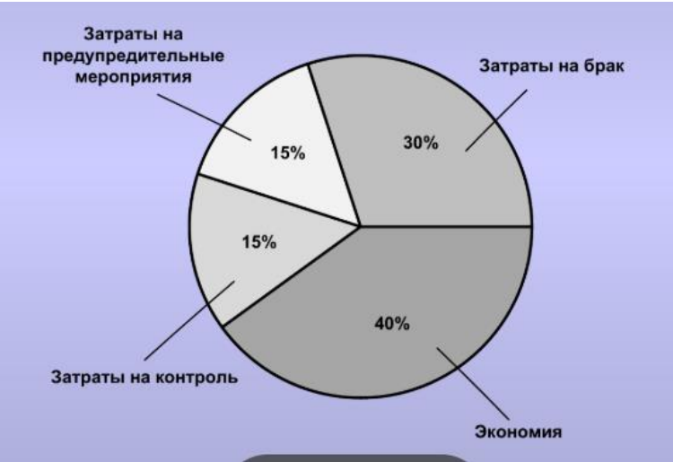
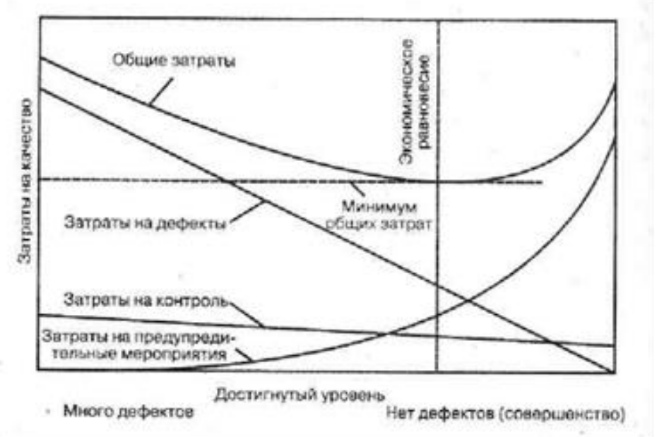
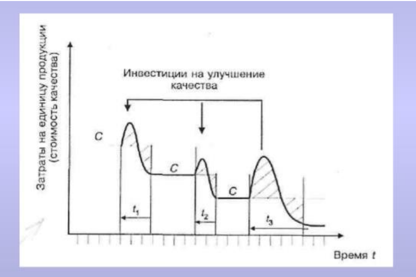

# Минимизация затрат на качество. Компоненты затрат, влияющие на общее снижение затрат на качество. Типичная структура элементов затрат на качество после проведения мероприятий по минимизации затрат. Взаимосвязь между затратами на качество и достигнутым уровнем качества. Инвестиции на улучшение качества и время их окупаемости.
Минимизация затрат – это деятельность, направленная на снижение стоимости качественного продукта с одновременным возрастанием его ценности.

