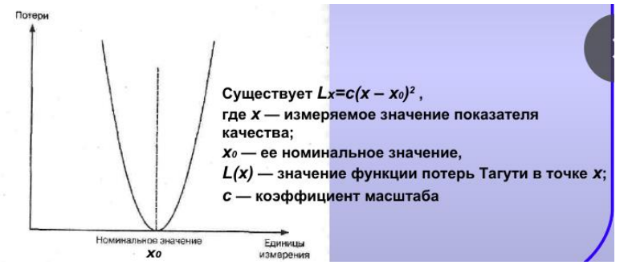

## Рекомендуемые методы снижения затрат на качество: 
1.  Технология развертывания функций качества (QFD) 
2.  Функционально-стоимостной анализ 
3.  Функционально-физический анализ 
4.  Анализ видов, последствий и критичности отказов (FMEA) 
5.  Функция потерь Тагути

При  проведении  функционально-стоимостного  анализа  определяют  функции 
элементов технического объекта или системы и проводят оценку затрат на 
реализацию этих функций, чтобы снизить затраты. 
 Этапы: 
1.  Последовательное  построение  моделей  объекта  ФСА  (компонентной, 
структурной,  функциональной),  модели  обычно  строят  в  табличной 
(матричной) форме 
2.  Исследование моделей и разработка предложений по совершенствованию 
объекта анализа 
 Схема процесса ФСА: исходная документация => компонентная модель объекта 
=>  структурная  модель  объекта  и  модель  материальных  потоков  => 
функциональная модель объекта => таблица анализа затрат на выполнение 
функций (проведение ФФА и FMEA анализа и усовершенствование объекта 
анализа) => начало 
Цель ФФА – анализ физических действий, а также технических и физических 
противоречий  в  технических  объектах  для  оценки  качества  принятых 
технологических решений и предложения новых. 
Последовательность проведения: 
1.  Формулировка проблемы 
2.  Составление описания функций назначения технического объекта 
3.  Проведение анализа надсистемы 
4.  Составление списка технических требований 
5.  Построение функциональной модели технического объекта 
6.  Анализ физических принципов действия функций технического объекта и 
определение технических и физических противоречий для них 
7.  Определение  способа  разрешения  противоречий  и  направления 
совершенствования технического объекта 
8.  Построение графиков эквивалентных схем, математических моделей 

## Функция потерь Тагути
  

Преимущества: 
1. Функция  потерь  Тагути  постоянно  поддерживает  в  нашем  сознании 
необходимость постоянных улучшений 
2. Даже очень  грубая оценка  функции  потерь дает чрезвычайно полезную 
информацию для ранжирования приоритетов в программе улучшений 
3. Использование функции потерь дает основу для количественных оценок 
значимости мероприятий по улучшению качества 
