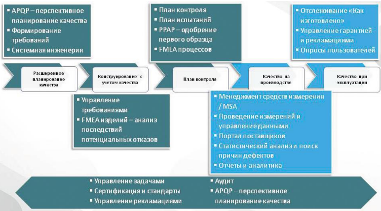

# Автоматизация менеджмента качества (АМК). Задачи системы менеджмента качества на разных стадиях ЖЦ. Функции типового программного комплекса CAQ-систем. Специально разработанная аппаратура CAQ-систем. Этапы реализации CAQ-систем.
Автоматизация менеджмента качества АМК

Суть автоматизации менеджмента качества (АМК) – заключается в перенесении
большей части операций и процессов, наполняющих деятельность по управлению
качеством в рамках специализированного программного обеспечения
Задачи систем менеджмента качества на разных стадиях ЖЦ
QMS-системы — модульные. Задачи, решаемые этими модулями, показаны на рисунке в
привязке к этапам жизненного цикла изделия.
Некоторые задачи выполняются на конкретном этапе. Например, FMEA — на стадии
конструирования изделия или разработки техпроцессов производства, управление
данными измерения — на стадии производства. В то же время, часть задач распределена
по всем этапам — это управление рекламациями, аудит, сертификация и, конечно, APQP

Функции типового программного комплекса CAQ-систем:
* Администрирование средств измерения
* Управление электронными документооборотом
* Использование цифровой подписи
* Отслеживание серийных номеров изделий/партий
* «панель управления» поставщиками
* Интеграция САПР
* Аналитические инструменты (графики, диаграммы, таблицы, блоксхемы)
* «вебпорталы» для поставщиков или заказчиков
* Рассылка e-mail
* Конструкторы форм
* Интеграция ERP и MES

Специально разработанная аппаратура CAQ-систем:
* Контрольно-измерительные станции (стенды)
* Системы сигнализации
* Оборудование для подключения к средствам измерения

Этапы реализации CAQ-систем:
* Обозначение потребности в АМК
* Проведение внутреннего и внешнего аудита предприятия для изучения перспектив внедрения
* Выбор разработчика и интегратора системы
* Приобретение и установка системы
* Интеграция системы в существующую информационную инфраструктуру предприятия
* Обучение персонала пользованию системы

