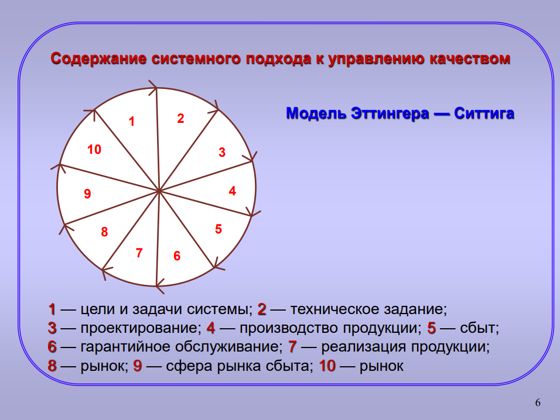
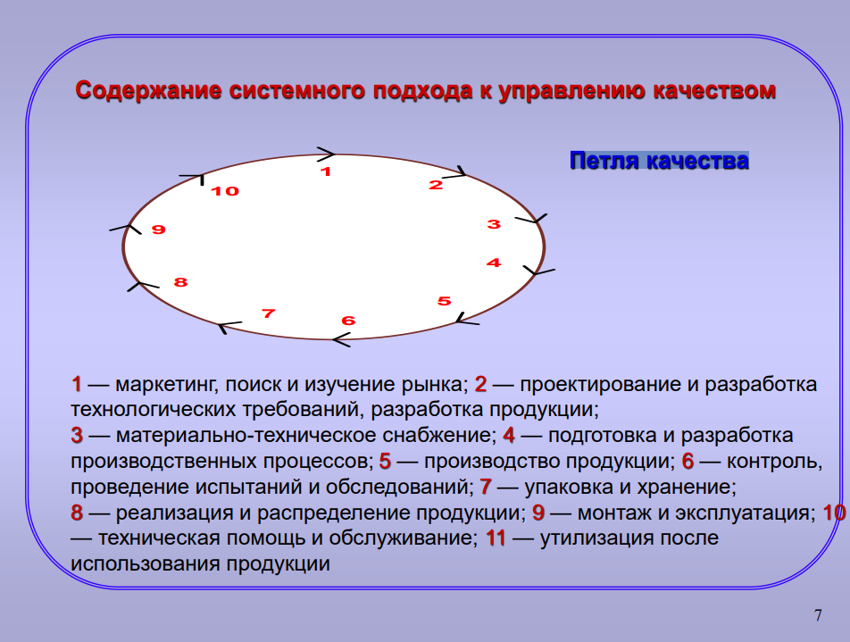

## Системный подход заключается: 
*  В  определении  взаимосвязанных  процессов  осуществляемых  в 
организации 
*  Управлении  этими  процессами  как  системой  для  достижения  целей  в 
области  качества,  направленных  на  повышение  результативности  и 
эффективности деятельности организации 

## Объекты и субъекты управления СМК (СМК – система менеджмента качества) 
* Субъекты  управления  –  руководители  различных  уровней  организации, 
осуществляющие управление качеством на своих уровнях. 
* Объекты управления: процессы, продукция, персонал. 

## СМК характеризуются: 
* Четко сформулированной целью (политики, стратегия) 
*  Определенным  составом,  структурой  специализированных 
управленческих органов 
* Точно очерченным контуром влияния системы на качество продукции, 
персонала, организацию в целом 
*  Наличием  прямых  и  обратных  связей  между  субъектами  и  объектами 
управления в системе
 
## Модели в зависимости от назначения: 
*  Абстрактно  –  исследовательские  (предназначен  для  исследования 
состояния функционирования системы, ее составляющих. Выявление факторов 
и причин, способствующих и препятствующих ее развитию. На основе данного 
вида  моделей  разрабатываются  рекомендации  по  совершенствованию 
существующей системы управления качеством) 
* Абстрактно – проектировочные (имеют практическую направленность, 
применяются с целью создания реальных систем, особенно на начальных этапах 
создания системы) 
*  Абстрактно  –  нормативные  (содержит,  например,  установленные 
требования к системе менеджмента качества (ИСО 9001)) 

## Модели в зависимости от формы представления: 
*  Описательные  (содержит  описания  СМК  (формулировка  целей  и 
задания)) 
* Графические (позволяет наглядно представить УК, ее составляющие и 
взаимосвязи с помощью простых графических средств) 
* Смешанные 

